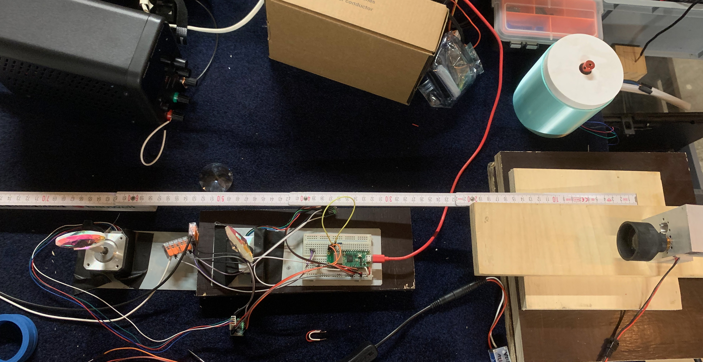
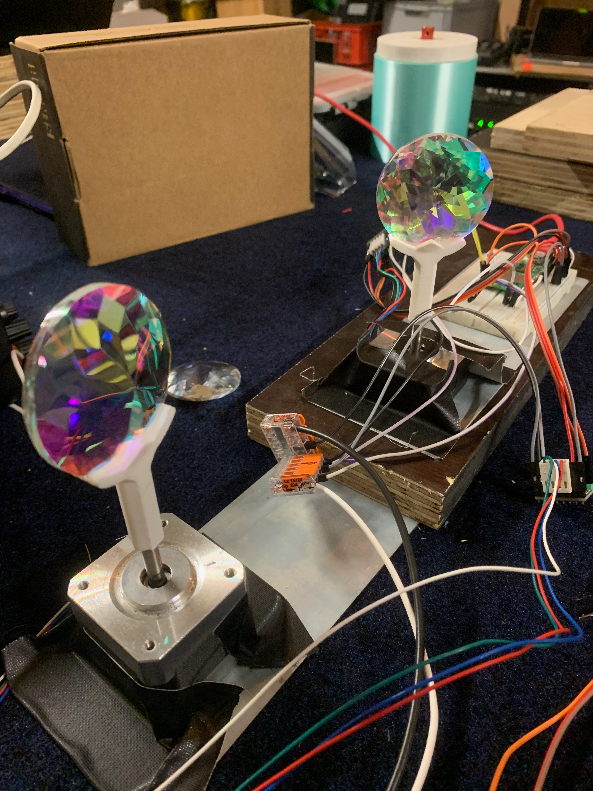

# Laserwebb

Light installation consisting of two rotating prism like optics illuminated by a light beam

Uses the [TMC_2209_ESP32 and Micropython](https://github.com/kjk25/TMC2209_ESP32) library to drive the motor.

This code is highly experimental. We did use a TMC2226 instead of a TCM2209 motor controller. UART is currently not working at all, which means 
we could not change any configuration options of the motor controller and are using the default settings.
